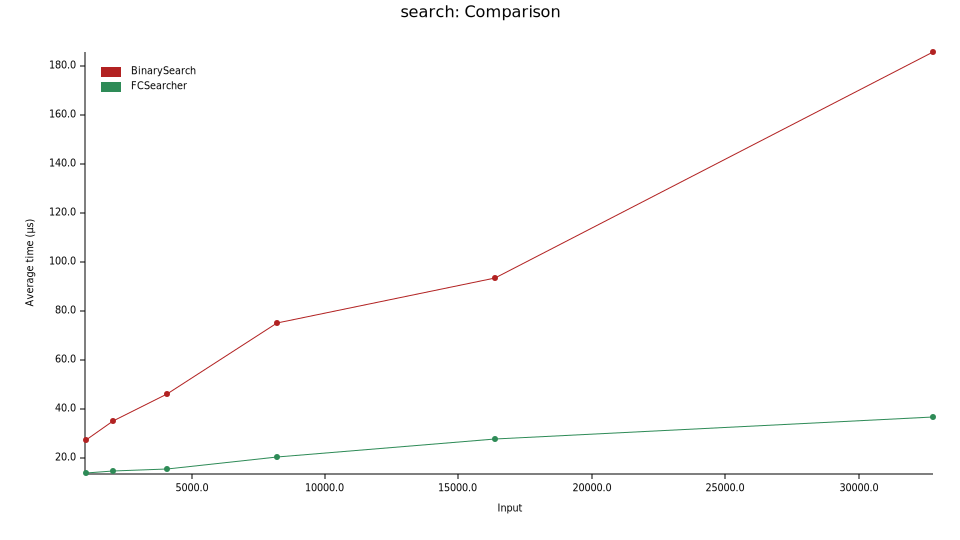

# Fractional Cascading

A Rust implementation of the [Fractional Cascading](https://en.wikipedia.org/wiki/Fractional_cascading) data structure.

Given `k` sorted slices, it answers "how many elements are less than `x` in each slice?" in **O(log n + k)** time after **O(n)** preprocessing, compared to **O(k log n)** for naive repeated binary search.

## Usage

```rust
use fractional_cascading::FCSearcher;

// Sources must be sorted slices.
let sources = vec![
    vec![1, 3, 6, 10],
    vec![2, 4, 5, 7, 8, 9],
];

let searcher = FCSearcher::new(&sources);

// Returns the number of elements strictly less than the key in each source.
let positions = searcher.search(&6);
assert_eq!(positions, [2, 3]); // sources[0]: 2 elements < 6; sources[1]: 3 elements < 6

// Lazy iterator variant — yields one position per source, in reverse order (last source first).
for pos in searcher.search_iter(&6) {
    println!("{pos} elements < 6");
}
```

## Benchmarks (v0.3.1)

CPU: AMD Ryzen 5 4600H with Radeon Graphics (12) @ 3.000GHz

Benchmark: 40 catalogs, 50 random keys, catalog sizes from 1 K to 32 K elements.
`FCSearcher` is compared against repeated `slice::partition_point` (naive binary search).



## References

- [Wikipedia — Fractional Cascading](https://en.wikipedia.org/wiki/Fractional_cascading)
- [NEERC wiki (Russian)](https://neerc.ifmo.ru/wiki/index.php?title=%D0%A2%D0%B5%D1%85%D0%BD%D0%B8%D0%BA%D0%B0_%D1%87%D0%B0%D1%81%D1%82%D0%B8%D1%87%D0%BD%D0%BE%D0%B3%D0%BE_%D0%BA%D0%B0%D1%81%D0%BA%D0%B0%D0%B4%D0%B8%D1%80%D0%BE%D0%B2%D0%B0%D0%BD%D0%B8%D1%8F)
